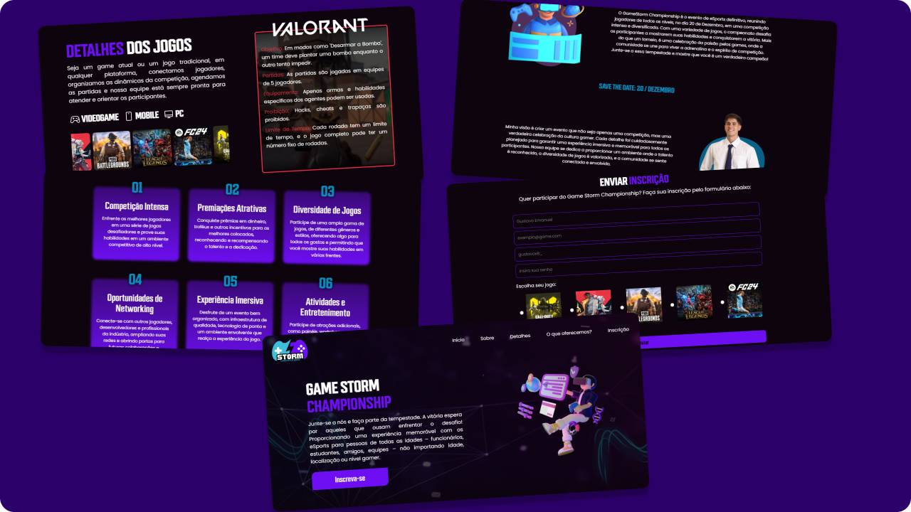

# 🎮 Game Storm Championship

A Game Storm Championship é um sistema web responsável pelo controle das inscrições de um campeonato de jogos eletrônicos, desenvolvido em Html + Css + Js. Ele proporciona uma interface agradável e intuitiva para o usuário.



## 🚀 Funcionalidades

- **Regras dos Jogos**: Após selecionar um jogo, o usuário poderá verificar quais são as regras daquele jogo para o campeonato.
- **Enviar Inscrição**: Com um formulário validado, o usuário conseguirá se inscrever no campeonato.

## 🖥️ Como rodar o projeto

Faça clone do projeto.
```tsx
git clone https://github.com/GustavoeDev/game-storm-championship.git
````

Inicialize o projeto com "Open with Live Server"

